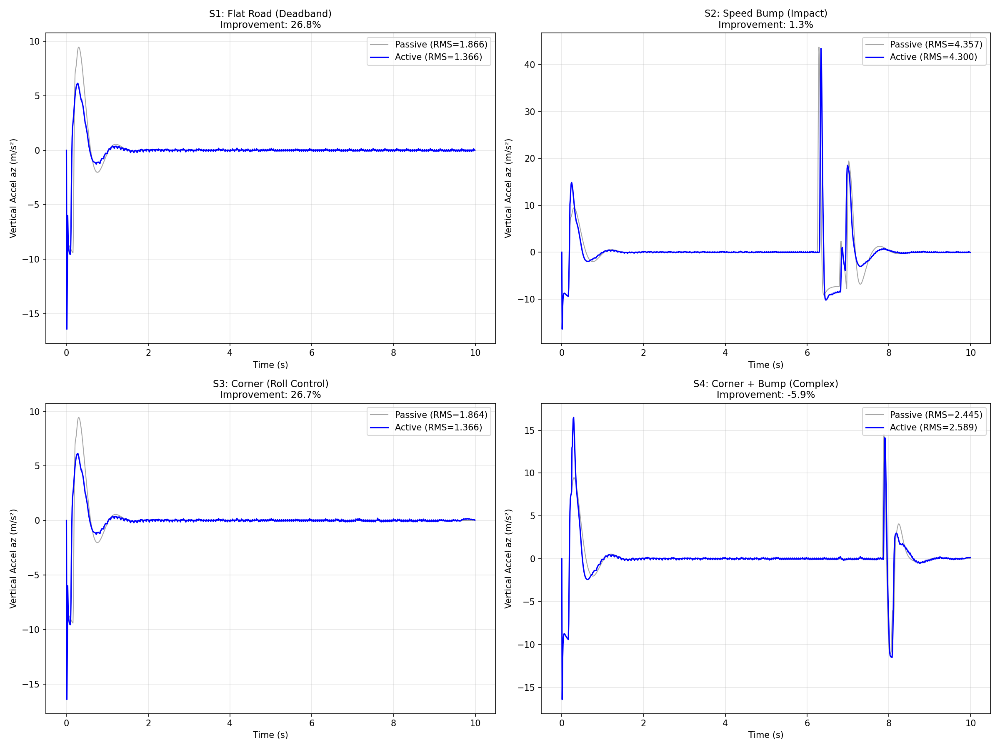
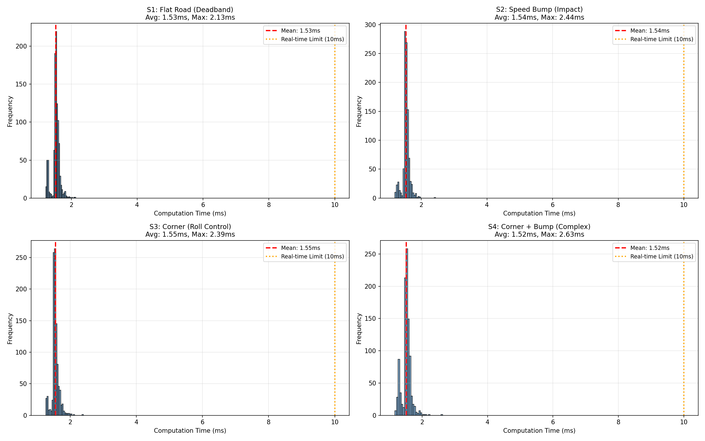
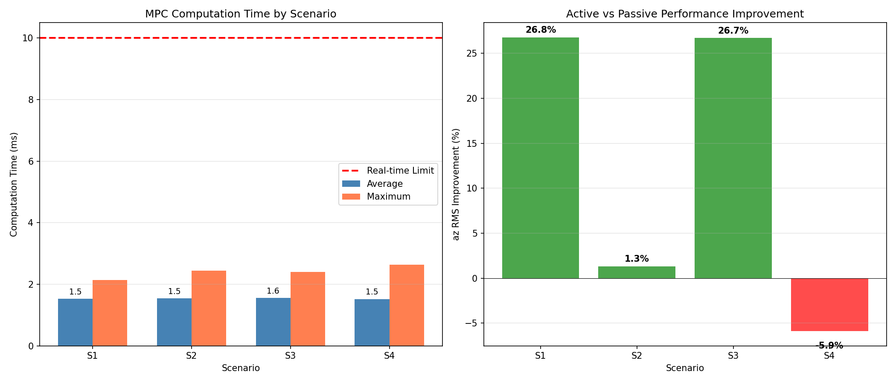

# MPC主动悬架 性能验证报告

**生成时间**: 2026-01-16 09:48:31

## 1. 测试配置

- 仿真时长: 10.0s
- 预测时域 N: 20
- 控制时域 Nc: 3
- 权重参数: q_z=100, q_vz=50, r_suspension=0.01 (Low q_z - Optimal for Speed Bump)
- 控制器: MPC (Active) vs Passive (无主动悬架)
- 采样率: 100Hz

## 2. Ride Comfort 指标对比

| 场景 | 模式 | z RMS (m) | z P2P (m) | vz RMS (m/s) | az RMS (m/s²) | az P2P (m/s²) | az改善 |
| :--- | :--- | :---: | :---: | :---: | :---: | :---: | :---: |
| Flat Road | Passive | 0.4982 | 0.4220 | 0.3327 | 1.8657 | 25.90 | - |
| | Active | 0.6053 | 0.2864 | 0.2298 | 1.3658 | 22.56 | **26.8%** |
| Speed Bump | Passive | 0.5150 | 0.6267 | 0.5495 | 4.3575 | 60.20 | - |
| | Active | 0.6169 | 0.5351 | 0.4654 | 4.2999 | 59.90 | **1.3%** |
| Corner | Passive | 0.4988 | 0.4215 | 0.3291 | 1.8639 | 25.88 | - |
| | Active | 0.6060 | 0.2864 | 0.2248 | 1.3660 | 22.56 | **26.7%** |
| Corner + Bump | Passive | 0.4999 | 0.4219 | 0.3509 | 2.4452 | 30.94 | - |
| | Active | 0.6053 | 0.3614 | 0.3009 | 2.5892 | 32.92 | **-5.9%** |

## 3. MPC计算效率

| 场景 | 平均时间(ms) | 最大时间(ms) | 最小时间(ms) | 标准差(ms) | 实时性 |
| :--- | :---: | :---: | :---: | :---: | :---: |
| S1 | 1.53 | 2.13 | 1.22 | 0.12 | ✓ 满足 |
| S2 | 1.54 | 2.44 | 1.20 | 0.11 | ✓ 满足 |
| S3 | 1.55 | 2.39 | 1.26 | 0.11 | ✓ 满足 |
| S4 | 1.52 | 2.63 | 1.17 | 0.14 | ✓ 满足 |

## 4. 总结

- 平均az RMS改善: **12.2%**
- 最大az RMS改善: **26.8%** (场景1)
- 最小az RMS改善: **-5.9%** (场景4)
- 平均MPC计算时间: **1.54ms**
- 最大MPC计算时间: **2.63ms**
- 实时性约束 (10ms): **满足** ✓

## 5. 可视化结果

### 舒适性对比

### 计算效率

### 汇总
